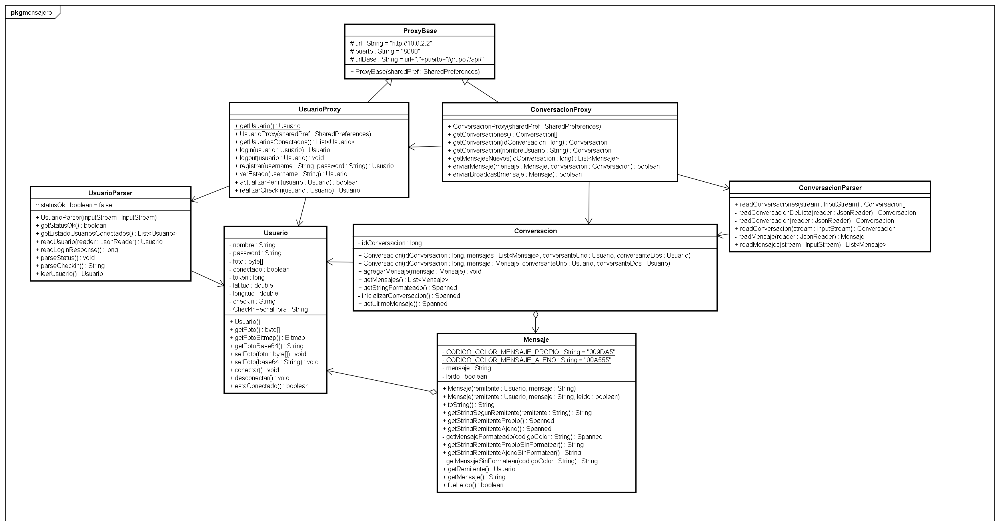

#######
Cliente
#######

***********************
Descripción del cliente
***********************

El Cliente es una aplicación Android para ser instalada y ejecutada en dispositivos moviles como Celulares y Tablets con dicho sistema operativo. Su funcionalidad es conectarse con el servidor, enviar mensajes y obtener la respuesta del mismo.

**********
Aplicación
**********

El cliente es una aplicación nativa Android, la misma va a estar generada en un archivo apk.

Versión minima del sistema operativo
====================================

La aplicación esta compilada para correr en la API 21

Instalación
===========

En un dispositivo movil real
----------------------------

Copiar el archivo apk al dispositivo movil y abrirlo, al hacerlo se instalara la aplicación. 

En el emulador de Android
-------------------------

En caso de utilizar un emulador los pasos a seguir son:

* Abrir el emulador (con el Android Device Manager o similar)

* Abrir una consola y ejecutar:

.. sourcecode:: bash

	$ abd install [ruta hasta el apk]

Ejemplos
........

.. sourcecode:: bash

	$ abd install ./archivos/mensajero.apk

.. sourcecode:: batch

	> abd install C:\archivos\mensajero.apk

******
Diseño
******

   Diagrama del cliente

En la figura se muestra el diseño del cliente y sus partes mas importantes; estas son detalladas a continuación:

Usuario
=======

Es la clase que maneja todos los datos del mismo, como: nombre, password, si esta conectado, la foto, los datos del checkin, etc.

UsuarioParser
=============

Clase encargada de parsear el stream que envia el servidor hacia el cliente

UsuarioProxy
============

Clase encargada de la comunicacion con el servidor en lo que respecta a los usuarios

Conversacion
============

Clase que maneja todo respecto a las conversaciones, por ahora solo se utiliza para las pantallas

Mensaje
=======

Clase que maneja todos los datos de un mensaje, por ahora solo se utiliza para las pantallas

