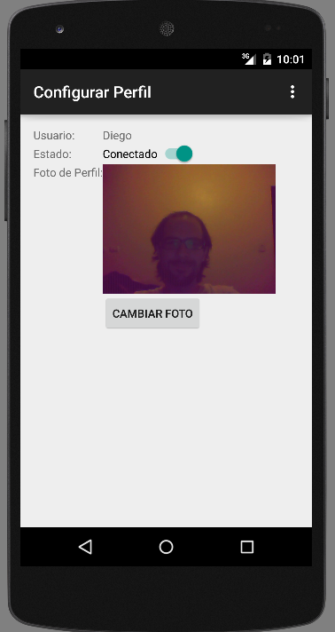

#######
Cliente
#######

***********************
Descripción del cliente
***********************

El Cliente es una aplicación Android para ser instalada y ejecutada en dispositivos moviles como Celulares y Tablets con dicho sistema operativo. Su funcionalidad es conectarse con el servidor, enviar mensajes y obtener la respuesta del mismo.

*********
Pantallas
*********

.. figure:: pantallas_cliente/Login.png
Pantalla de Autenticación (Login)

Desde aquí el usuario entra en la aplicación y pone sus datos para poder ingresar, en caso de que sea la primera vez que ingrese en la aplicación debera registrarse tocando el botón "CREAR NUEVA CUENTA". Si ya esta registrado debe ingresar su Usuario y Contraseña y luego tocar en el botón "INICIAR SESIÓN".

.. figure:: pantallas_cliente/Registracion.png
Pantalla de Registración

Desde aquí puede crear un nuevo Usuario, para ello se debe completar los campos Usuario y Contraseña, donde el usuario no puede existir ya en el sistema, y luego presionar el botón "REGISTRARSE", si los datos son correctos el Usuario sera registrado y logueado en el sistema.

.. figure:: pantallas_cliente/Lista_de_usuarios_conectados.png
Pantalla de Listado de Usuarios Conectados

Desde aquí se vera un listado de los usuarios que estan autentificados en el sistema, si toca sobre un usuario podra :ref:`ver el estado <verEstadoPantalla>` del mismo, desde el menu podra ir a :ref:`Configurar el perfíl <configurarPerfilPantalla>` del usuario logueado, enviar un mensaje de broadcast, realizar el checkin o salir de la aplicación. En la barra superior podra ir al listado de conversaciones del usuario autentificado.

.. _configurarPerfilPantalla:

Pantalla de Configuración de Perfíl

Desde aquí se puede cambiar los datos del Usuario autentificado, se encuentra posible cambiar: el Estado de conexión (Conectado o Desconectado), si se pone como desconectado los otros usuarios no podran verlo, tambien puede cambiar la Foto de Perfíl eligiendo de la galería del dispositivo una nueva. Para volver a la pantalla anterior en el menú presione "Volver"

.. _verEstadoPantalla:
.. figure:: pantallas_cliente/Ver_Estado_de_usuario.png
Pantalla para Ver Estado de Usuario
Aquí le aparecera toda la información del usuario seleccionado: Nombre, Estado, Último Checkin(donde y cuando lo realizo) y la foto de perfíl del mismo. Para volver a la pantalla anterior en el menú presione "Volver", si desea iniciar una conversación o volver a la :ref:`conversación <conversacionPantalla>` existente con este usuario en el menú presione "Envíar Mensaje"

.. _conversacionPantalla:
.. figure:: pantallas_cliente/Conversación.png
Pantalla de Conversación

Aqui podra escribir mensajes hacia otro usuario y recibir los que le envíe este.
