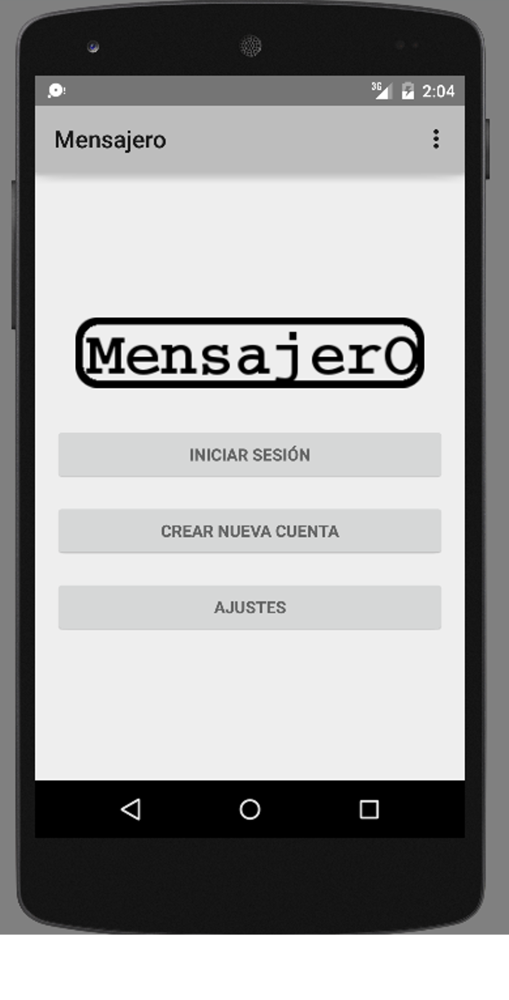
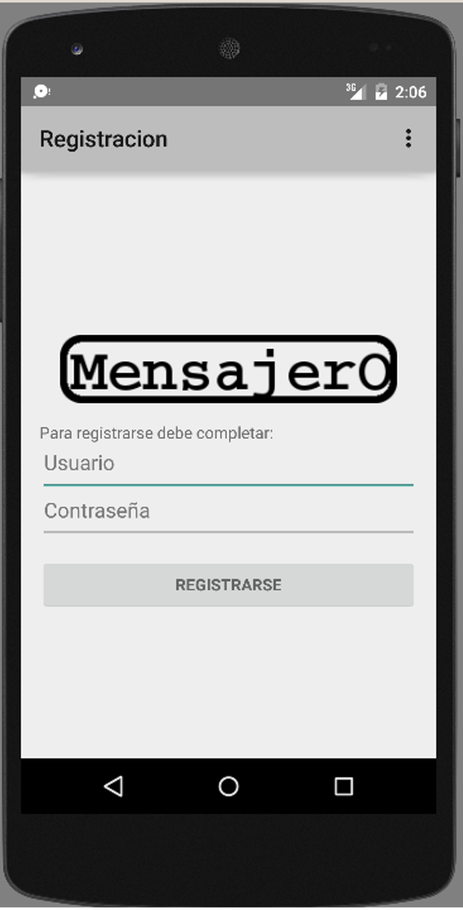
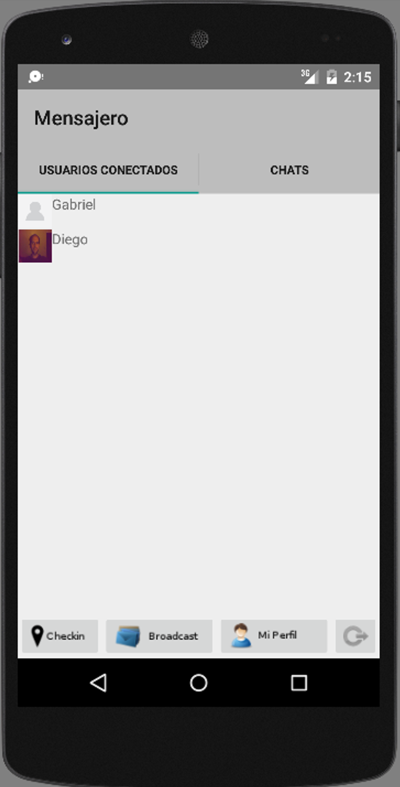

*****************
Pantallas Cliente
*****************

A continuación se muestran y explican las pantallas mas importantes de la aplicación.

Pantalla de Inicio
==================

Esta es la primer pantalla de la aplicación desde aquí el usuario podra elegir entre iniciar sesión con una cuenta existente, registrarse para tener una nueva cuenta, o cambiar los ajustes de la aplicación (solo para la versión BETA dado que luego la ip y puerto del servidor seran fijas, asi como las demoras de los refrescos de Listado de Usuarios Conectados, Listado de Conversaciones o en una conversación)

Pantalla de Autentificación (Login)
===================================
.. figure:: pantallas_cliente/login.png
	:scale: 50 %
	:align: center

Desde aquí el usuario pone sus datos para poder ingresar, en caso que deba registrarse y no lo hizo en la pantalla anterior puede hacerlo tocando el botón "CREAR NUEVA CUENTA". Si ya esta registrado debe ingresar su Usuario y Contraseña y luego tocar en el botón "INICIAR SESIÓN". Si el usuario lo desea para mayor comodidad puede marcar la opción de "Recordar Datos" y así evitar ingresar estos datos cada vez que accede a la aplicación.

Pantalla de Registración
========================

Desde aquí puede crear un nuevo Usuario, para ello se debe completar los campos Usuario y Contraseña, donde el usuario no puede existir ya en el sistema, y luego presionar el botón "REGISTRARSE", si los datos son correctos el Usuario sera registrado y logueado en el sistema.

.. _users:

Pantalla de Lista de Usuarios Conectados
========================================

Desde aquí se vera un listado de los usuarios que estan autentificados en el sistema, si toca sobre un usuario podra :ref:`ver el estado <verEstadoPantalla>` del mismo, desde el menu podra ir a :ref:`Mi Perfil <configurarPerfilPantalla>`, :ref:`enviar un mensaje de Broadcast <broadcast>`, realizar el :ref:`Checkin <checkin>` o cerrar sesión de usuario. En la barra superior o con un swipe hacia la derecha podra ir al :ref:`listado de conversaciones <chats>` del usuario autentificado (Chats).

.. _configurarPerfilPantalla:

Pantalla de Configuración de perfíl (Mi Perfil)
===============================================
.. figure:: pantallas_cliente/configurar_perfil.png
	:scale: 15 %
	:align: center

Desde aquí se puede cambiar los datos del Usuario autentificado, se encuentra posible cambiar: el Estado de conexión (Conectado o Desconectado), si se pone como desconectado los otros usuarios no podran verlo, tambien puede cambiar la Foto de Perfíl eligiendo de la galería del dispositivo una nueva. Para volver a la pantalla anterior presione la tecla de "atras" de su dispositivo o la flecha <- que se encuentra arriba a la izquierda de la pantalla.

.. _verEstadoPantalla:

Pantalla para Visualización de Estado de Usuario
================================================

.. figure:: pantallas_cliente/ver_estado_de_usuario.png
	:scale: 15 %
	:align: center

Aquí le aparecera toda la información del usuario seleccionado: Nombre, Estado, Último Checkin(donde y cuando lo realizo) y la foto de perfíl del mismo. Para volver a la pantalla anterior presione la tecla de "atras" de su dispositivo o la flecha <- que se encuentra arriba a la izquierda de la pantalla, si desea iniciar una conversación o volver a la :ref:`conversación <conversacionPantalla>` existente con este usuario en el menú presione "Envíar Mensaje" o el icono con forma de sobre que se encuentra arriba a la derecha de la pantalla.

.. _chats:

Pantalla de Listado de Conversaciones (Chats)
=============================================

Desde aquí el usuario puede ver las conversaciones que tiene activas con otros usuarios y seleccionar una conversación para continuarla, las conversaciones cuyo mensaje aparezcan en negrita (siempre arriba en el listado) son las que tienen mensajes nuevos sin leer. En la barra superior o con un swipe hacia la izquierda podra ir al :ref:`Listado de usuarios conectados <users>`.

.. _conversacionPantalla:

Pantalla de Conversación
========================

.. figure:: pantallas_cliente/conversacion.png
	:scale: 50 %
	:align: center

Aqui podra escribir mensajes hacia otro usuario y recibir los que le envíe este. Sus mensajes apareceran en Celeste y los del otro usuario en verde, para escribir un mensaje toque en el texto "Escriba un mensaje", escriba el mensaje y presione el botón "ENVIAR"

.. _broadcast:

Pantalla de envio de Mensaje de Broadcast
=========================================

.. figure:: pantallas_cliente/broadcast.png
	:scale: 15 %
	:align: center

Desde aquí el usuario podra enviar un mensaje a todos los usuarios que aparecen como conectados del sistema, para escribir un mensaje toque en el texto "Escriba un mensaje", escriba el mensaje y presione el botón "ENVIAR A TODOS LOS USUARIOS CONECTADOS". Si el mensaje se envia correctamente le avisara y podra ver las conversaciones en el :ref:`listado de conversaciones <chats>`

.. _checkin:

Pantalla de realización de Checkin
==================================

.. figure:: pantallas_cliente/checkin.png
	:scale: 50 %
	:align: center

Desde aquí el usuario podrá registrar donde se encuentra actualmente para que el resto de los usuarios puedan verlo, al usuario le aparece el mapa donde se encuentra actualmente, debe presionar el boton que dice "REALIZAR CHECKIN" y esperar a la respuesta "Todos los cambios guardados", el sistema calculara cual es el lugar mas cercano al que esta el usuario. Uno puede ver su último checkin desde :ref:`Mi Perfil <configurarPerfilPantalla>`.
