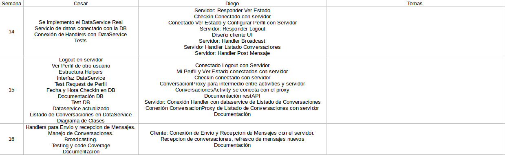

Gestion del Proyecto
====================

El proyecto se encaro de la siguiente manera, primero tomo la funcionalidad a realizar por cada una de las aplicaciones y luego se dividio las tareas a realizar por cada integrante del grupo. Luego de separar las tareas se empezo a la codificación del proyecto y para cada checkpoint ver que se podia ir haciendo y ver a que llegabamos para entregar.

División de Tareas
==================

Cesar Leguizamon
----------------

Encargado de la aplicación Servidor, esto implica:

* Diseño general del servidor.
* Diseño de la base de datos.
* Seteo del sistema de compilación.
* Seteo del sistema de testeo.
* Configuración de la documentación del servidor (Doxygen).
* Configuración de la generación de *code coverage*.
* Configuración de la librerias utilizadas.
* Implemetación del servidor.
* Implemetación de la base de datos.
* Implemetación de los unit tests.
* Documentación del servidor.

Diego Meller
------------

Aplicación Cliente, se detalla a continuación

* Registrar Usuario.
* Ver estado de usuario.
* Configurar Perfil.
* Ver listado de usuarios conectados.
* Enviar mensaje de broadcast.
* Configurar Ajustes de la aplicación.
* Conexión de la aplicación cliente con la RestAPI (todas las funcionalidades entregadas).
* Documentación

Aplicación Servidor:

* Diseño inicial de la base de datos.
* Request y Handlers de Conversacion y Mensaje.
* Documentación de RestAPI.

Tomas Franco
------------

Aplicación Cliente, se detalla a continuación

* Pantalla de Autentificación de Usuario
* Pantalla de Realizar Checkin
* Pantalla de Listado de Conversaciones
* Pantalla de Conversación

Cronograma
==========

.. figure:: tareas_semanas_1a8.png

.. figure:: tareas_semanas_9a13.png

Control de Versiones y workflow
===============================

Para el control de versiones se utilizo un repositorio git alojado de GitHub `https://github.com/mellerster/7552Grupo7/ <https://github.com/mellerster/7552Grupo7/>`_

En el mismo se realizaron un branch por cada entrega:

* `Primer Checkpoint <https://github.com/mellerster/7552Grupo7/tree/primer-checkpoint>`_

* `Segundo Checkpoint <https://github.com/mellerster/7552Grupo7/tree/segundo_checkpoint>`_

* `Entrega Final <https://github.com/mellerster/7552Grupo7/tree/Entrega_Final/>`_

Sistema Ticketing (ChangeLog)
=============================

El sistema de ticketing utilizado fue el de GitHub el mismo se encuentra en `https://github.com/mellerster/7552Grupo7/issues <https://github.com/mellerster/7552Grupo7/issues>`_

