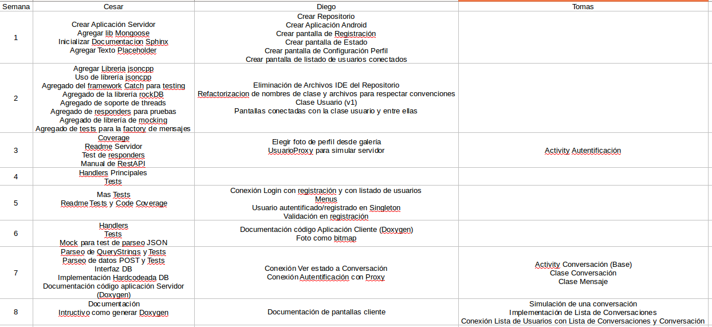
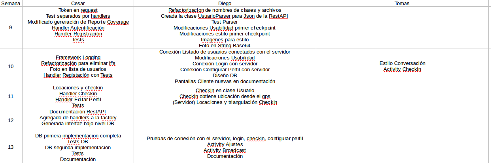

Gestion del Proyecto
====================

El proyecto se encaro de la siguiente manera, primero tomo la funcionalidad a realizar por cada una de las aplicaciones y luego se dividio las tareas a realizar por cada integrante del grupo. Luego de separar las tareas se empezo a la codificación del proyecto y para cada checkpoint ver que se podia ir haciendo y ver a que llegabamos para entregar.

División de Tareas
==================

Cesar Leguizamon
----------------

Encargado de la aplicación Servidor, esto implica:

* Diseño general del servidor.
* Diseño de la base de datos.
* Seteo del sistema de compilación.
* Seteo del sistema de testeo.
* Configuración de la documentación del servidor (Doxygen).
* Configuración de la generación de *code coverage*.
* Configuración de la librerias utilizadas.
* Implemetación del servidor.
* Implemetación de la base de datos.
* Implemetación de los unit tests.
* Documentación del servidor.

Diego Meller
------------

Aplicación Cliente, se detalla a continuación

* Registrar Usuario
* Ver estado de usuario
* Configurar Perfil
* Ver listado de usuarios conectados
* Enviar mensaje de broadcast
* Configurar Ajustes de la aplicación
* Conexión de la aplicación cliente con la RestAPI (todas las funcionalidades entregadas)

Tomas Franco
------------

Aplicación Cliente, se detalla a continuación

* Pantalla de Autentificación de Usuario
* Pantalla de Realizar Checkin
* Pantalla de Listado de Conversaciones
* Pantalla de Conversación

Cronograma
==========

Control de Versiones y workflow
===============================

.. note:: Para la proxima entrega realizar

Sistema Ticketing
=================

El sistema de ticketing utilizado fue el de GitHub el mismo se encuentra en `https://github.com/mellerster/7552Grupo7/issues <https://github.com/mellerster/7552Grupo7/issues>`_

Issues
------

1. Crear Aplicación Android 
2. Crear Pantalla de Login en Cliente
3. Crear Pantalla Registración Cliente
4. Crear Pantalla de Usuarios Logueados en Cliente
5. Crear Pantalla de Mensajes de Usuario en Cliente
6. Crear Pantalla con listado de conversaciones en Cliente
7. Crear Pantalla de Configuración de Perfíl en Cliente
8. Crear Pantalla de Checkin en Cliente
9. Crear Pantalla de Visualización de Estado en Cliente
10. Crear Pantalla de Envío de Conversaciones en Cliente
11. Realizar conexión del Cliente con la RestApi del Servidor
12. Crear Aplicación Servidor
13. Crear el Procesador de Mensajes
14. Agregar Tests para el Procesador de Mensajes
15. Generar Modelo de Base de Datos
16. Crear un Manejador para la Base de Datos
17. Agregar Tests para el manejador de base de datos
18. Documentar la Instalación y Compilación
19. Setear Doxygen
20. [server] Agregar autenticación 
21. Documentar el Diseño del Servidor
22. Definir los mensajes y parametros para cada pedido
23. [CLI] Conectar Activity Registrar al Servidor
24. Crear Documento para la 1º entrega
25. Crear Branch para Primer Checkpoint
26. Changelog por funcionalidades
27. Agregar Readme's al informe
28. Crear listado de tareas a entregar en el 2º checkpoint
29. [CLI] No es posible ingresar al sistema a través de la pantalla de login inicial 
30. [CLI] Mejorar distribución botones en pantalla login y registrar 
31. [CLI] Usabilidad funcionalidad checkin bug
32. [CLI] Mejorar estilo aplicación 
33. Servidor se cae luego de iniciar 2 veces seguidas bug
34. [server] Testear autenticación
35. [server] Crear responder para login
36. [server] Testear responder de login
37. [server] Crear responder para registración de usuarios
38. [server] Testear responder de registración de usuarios
39. [server] Crear responder de ver perfil de usuario
40. [server] Testear responder de ver perfil de usuario
41. [server] Crear el responder para editar un perfil de usuario
42. [server] Testear responder de editar perfil de usuario
43. [server] Modificar los DTOs para que tengan siempre "status" en lugar de token
44. [server] Incorporar un framework de loggeo
45. [server] Mejorar la interfaz de linea de comando del servidor
46. [server] Reemplazar los "ifs" del factory por algo mas escalable
47. [server] Analizar los parametros de tipo "string"
48. [CLI] Conectar Autentificación al Servidor
49. [CLI] Conectar Registración al Servidor
50. [CLI] Conectar Lista de Usuarios Conectados al servidor
51. [CLI] Conectar Ver Estado al servidor 
52. [CLI] Conectar Configurar Perfil al servidor
53. [CLI] Conectar Lista de Conversaciones al servidor
54. [CLI] Conectar Checkin al servidor
55. [CLI] Conectar Enviar Mensaje al servidor
56. [CLI] Conectar Ver Conversacion al servidor
57. [CLI] Conectar Enviar mensaje de broadcast al servidor
58. [server] Testear el manejar de locaciones

