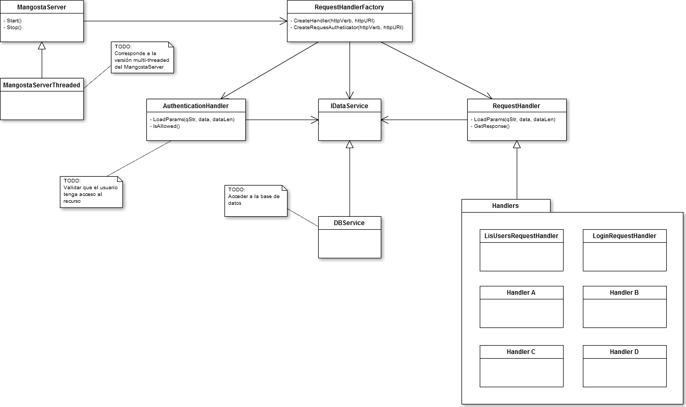

########
Servidor
########

El servidor provee una interfaz REST para que los distintos clientes puedan comunicarse entre si.

*********
Funciones
*********

El servidor debe ser capaz de cumplir un número de funciones; estan son:

**TODO**: Listar funciones

******
Diseño
******

   Diagrama del servidor (v2)

En la figura se muestra el diseño del servidor y sus partes mas importantes; estas son detalladas a continuación:

Mangostar server
================

Basado en *mongoose*, es el servidor web encargado de recibir los pedidos y enrutarlos hacia los componentes del sistema capaz de llevarlos a cabo.

Tiene una clase derivaba que extiende la clase base agregandole capacidades multi-threading.

Request handler Factory
=======================

Es un componente que instancia los manejadores especificos de cada tipo de pedido; por ejemplo: si se recibe un pedido de listar usuarios la *Factory* se encarga de instanciar un *Request Handler* de *List Users*.

Request handlers
================

Una clase base que define las operaciones de todos los manejadores.

Los diversos tipos de pedidos definidos en el servidor son:

* **Login Request handler**: Permite que un cliente inicie una sesión con el servidor.

* **List Users Request handler**: Devuelve al cliente una lista con todos los usuarios que actualmente tienen una sesión activa en el servidor.

**TODO:** Listar los otros request handlers

Authentication handler
======================

Un tipo especial de manejador de pedidos; tiene la funcionalidad de validar que el cliente tenga acceso al recurso que esta pidiendo. Esto es: No permitiria que un cliente sin sesión envie mensajes.

Data Service
============

Su objetivo es permitir el almacenamiento y la recuperación de los datos utilizados por el sistema.

Debido al costo que implican estas operaciones, el **Data Service** esta dividido en varias partes:

* *IDataService*: Una interfaz que define las operaciones con los datos.

* *DBService*: Una implementación de la anterior interfaz.

* *Models*: Un conjunto de clases que definen los datos con los que trabajará este servidio.

*********
Operación
*********

**TODO:** Explicar como controlar el servidor

**************************
Diseño de la Base de Datos
**************************

Dado que la base de datos es una base No-SQL y que se utiliza rocksdb que es una base de datos donde se accede por clave-valor el diseño sería preliminarmente así: 
 
Claves:  

* U/\<username\>  

* C/\<idconversacion\>  

* M/\<idmensaje\>  

* P/\<idparametro\>  
  
Paso a explicar cada clave y los valores que devuelve:  
  
**U/\<username\>**
==================

Se accede por el nombre de usuario con el prefijo U/ para remarcar que es un usuario esto devuelve un valor que tendrá dentro:  

* contraseña

* checkin (puede ser solo el texto del checkin "El 3/5/15 a las 15.30hs en Facultad de Ingeniería" o la latitud, longitud, lugar, fecha y hora por separado a criterio del programador)

* foto (en base64 tipo texto)

* conversaciones (array de conversaciones que tendra remitente y idconversacion)

* mensajessinrecibir (array que contiene idmensaje y idconversacion de todos los mensajes que no recibió el usuario todavía)

**C/\<idconversacion\>**  
========================

Se accede por el id de la conversación (número autoincremental) con el prefijo C/ para separar de los ids de mensajes u otras claves, esto devuelve un valor que tendrá dentro:  

* usuario 1 de la conversación (username)  

* usuario 2 de la conversación (username)  

* mensajes (array de idmensaje)  

**M/\<idmensaje\>**  
===================

Se accede por el id del mensaje (número autoincremental) con el prefijo M/ para separar de los ids de conversaciones u otras claves, esto devuelve un valor que tendrá dentro:  

* usuario (el usuario que envió el mensaje)  

* texto (texto del mensaje)  

**P/\<idparametro\>**  
=====================

Estas claves son para configuraciones internas del servidor por ejemplo podrian ser:  

* P/idultimaconversacion (para obtener el id, sumarle 1 y volver a guardar)  

* P/idultimomensaje (ídem)  

Todos los valores pueden ser almacenados en la base de datos como JSon, XML u otra manera cómoda para identificar cada ítem dentro del mismo, esto queda a criterio del programador.

