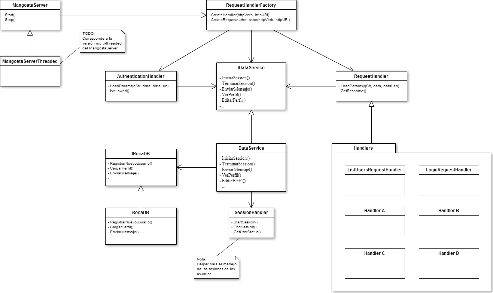

########
Servidor
########

El servidor provee una interfaz REST para que los distintos clientes puedan comunicarse entre si.

*********
Funciones
*********

El servidor debe ser capaz de cumplir un número de funciones; estan son:

**TODO**: Listar funciones

******
Diseño
******

   Diagrama del servidor (v3)

En la figura se muestra el diseño del servidor y sus partes mas importantes; estas son detalladas a continuación:

Mangostar server
================

Basado en *mongoose*, es el servidor web encargado de recibir los pedidos y enrutarlos hacia los componentes del sistema capaz de llevarlos a cabo.

Tiene una clase derivaba que extiende la clase base agregandole capacidades multi-threading.

Request handler Factory
=======================

Es un componente que instancia los manejadores especificos de cada tipo de pedido; por ejemplo: si se recibe un pedido de listar usuarios la *Factory* se encarga de instanciar un *Request Handler* de *List Users*.

Request handlers
----------------

Una clase base que define las operaciones de todos los manejadores.

Los diversos tipos de pedidos definidos en el servidor son:

* **Login Request handler**: Permite que un cliente inicie una sesión con el servidor.

* **List Users Request handler**: Devuelve al cliente una lista con todos los usuarios que actualmente tienen una sesión activa en el servidor.

* **User Sign Up Request handler**: Permite que un nuevo usuario se registre en el sistema.

* **Edit Perfil handler**: Permite que un usuario del sistema modifique los datos que se muestran en su perfil.

* **Checkin handler**: Tiene una doble función; guarda la ubucación del usuario y devuelve una descripción del punto conocido mas cercano.

**TODO:** Listar los otros request handlers

Authentication handler
----------------------

Un tipo especial de manejador de pedidos; tiene la funcionalidad de validar que el cliente tenga acceso al recurso que esta pidiendo. Esto es: No permitiria que un cliente sin sesión envie mensajes.

Data Service
============

Su objetivo es permitir el almacenamiento y la recuperación de los datos utilizados por el sistema.

Debido al costo que implican estas operaciones, el **Data Service** esta dividido en varias partes:

* *IDataService*: Una interfaz que define las operaciones con los datos.

* *DataService*: Una implementación de la anterior interfaz.

* *IRocaDB*: Una interfaz que define las operaciones relacionadas con la base de datos.

* *RocaDB*: Una implementación de la anterior interfaz.

* *SessionHandler*: Un clase "helper" que se encarga del manejo de las sesiones de los usuarios.

*********
Operación
*********

**TODO:** Explicar como controlar el servidor

